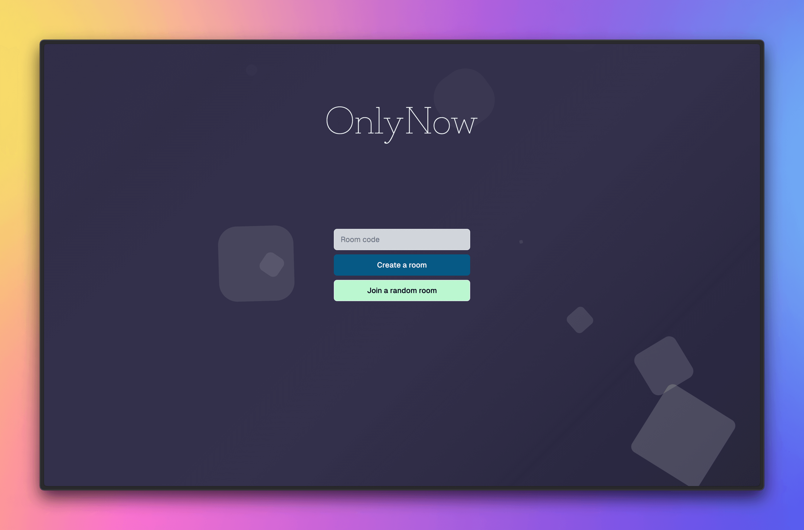

# OnlyNow

[](https://onlynow.yumi.to/)

A simple chat app that allows you to chat with people who are online in the same room as you.

## Supabase Launch Week X Hackathon

This project was built for the [Supabase Launch Week X Hackathon](https://supabase.com/blog/supabase-hackathon-lwx).

We are [Finn](https://github.com/FinnThompson) and [Yumi](https://yumiizumi.com).

## Roadmap

After successful initial release, the following features are planned:

- [ ] End-to-end encryption
- [ ] Optional user authentication
- [ ] Mobile app

For a detailed information about the roadmap, please refer to the [project board](https://github.com/users/izyumidev/projects/4).

## Stack

The app is built with the following technologies:

- [React](https://reactjs.org/)
- [Next.js](https://nextjs.org/)
- [shadcn/ui](https://ui.shadcn.com/)
- [Tailwind CSS](https://tailwindcss.com/)
- [Supabase](https://supabase.com/)
- [Vercel](https://vercel.com/)

## Supabase Backend

### Database

There is only one tabel in the database, `room`, which is defined as follows:

```sql
create table
  public.room (
    id uuid not null default gen_random_uuid (),
    created_at timestamp with time zone not null default now(),
    private boolean not null default true,
    online_members uuid[] null,
    creator uuid null,
    room_code text null,
    constraint room_pkey primary key (id)
  ) tablespace pg_default;
```

Row Level Security (RLS) is not defined to not allow any direct interactions with the database by the clients. Instead, all interactions are done through the Edge Functions.

### Edge Functions

All edge functions are defined in the [`supabase/functions`](./supabase/functions/) directory and are hosted on Supabase.

## License

This project is licensed under the MIT License - see the [LICENSE](LICENSE) file for details. The project is fully open source, and we welcome contributions from the community.
